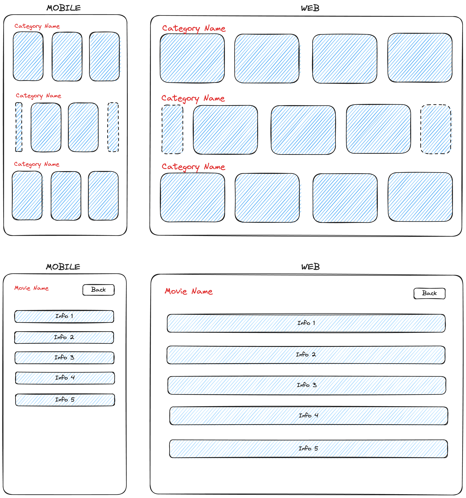

# Captflix

Captflix is a Vue 3 application built with Vite, designed to showcase a collection of movies. This project utilizes modern web technologies to provide a responsive and interactive user experience.

## Features

- Browse a curated list of movies
- Detailed view of movie information
- Responsive design for desktop and mobile devices
- **Search for movies by name** - Users can easily find movies by entering a search term related to the movie's name.

## Technical Assignment Checklist - Ready Set Go ABN Amro

This project includes a technical assignment checklist named `ready_set_go_ABN_Amro`, prepared specifically to ensure that all requirements of the assignment are thoroughly addressed. It serves as a comprehensive guide to not miss any critical steps or features needed for the project. You can find this checklist in the root directory of the project repository.

## Initial Design

The initial design for Captflix was created using [Excalidraw](https://excalidraw.com/). This helped in visualizing the layout and user interface components for the application. The design files can be found in the root directory.


## API Collection with Postman

For simplifying the understanding and execution of API calls, a Postman API collection named "TVMaze for ABN Amro" has been created. This collection includes predefined requests for searching shows, accessing the dashboard, and retrieving details for specific TV shows and it can be found in the root directory. It serves as a handy tool for developers working on integrating the TVMaze API with the Captflix application.## Recommended IDE Setup

[VSCode](https://code.visualstudio.com/) + [Volar](https://marketplace.visualstudio.com/items?itemName=Vue.volar) (and disable Vetur).

## Type Support for `.vue` Imports in TS

TypeScript cannot handle type information for `.vue` imports by default, so we replace the `tsc` CLI with `vue-tsc` for type checking. In editors, we need [Volar](https://marketplace.visualstudio.com/items?itemName=Vue.volar) to make the TypeScript language service aware of `.vue` types.

## Customize configuration

See [Vite Configuration Reference](https://vitejs.dev/config/).

## Prerequisites

Before you begin, ensure you have met the following requirements:

- **Node.js**: Version 20.x or newer
- **npm**: Version 9.x or newer

You can check your Node.js and npm versions by running `node -v` and `npm -v` in your terminal.

## Project Setup

```sh
npm install
```

### Compile and Hot-Reload for Development

```sh
npm run dev
```

### Type-Check, Compile and Minify for Production

```sh
npm run build
```

### Run Unit Tests with [Vitest](https://vitest.dev/)

```sh
npm run test:unit
```

### Lint with [ESLint](https://eslint.org/)

```sh
npm run lint
```
